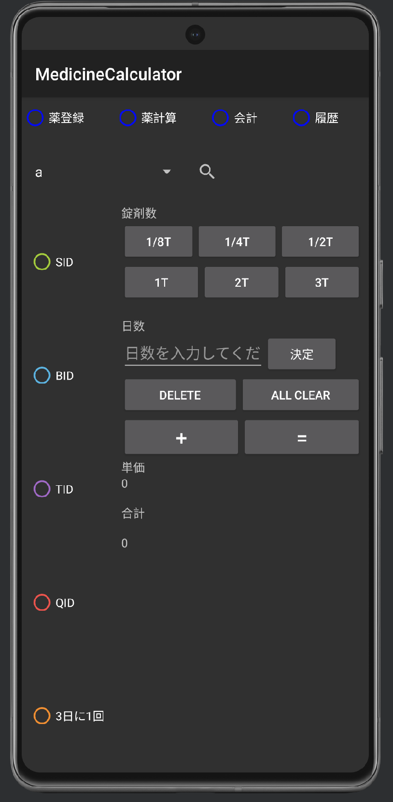
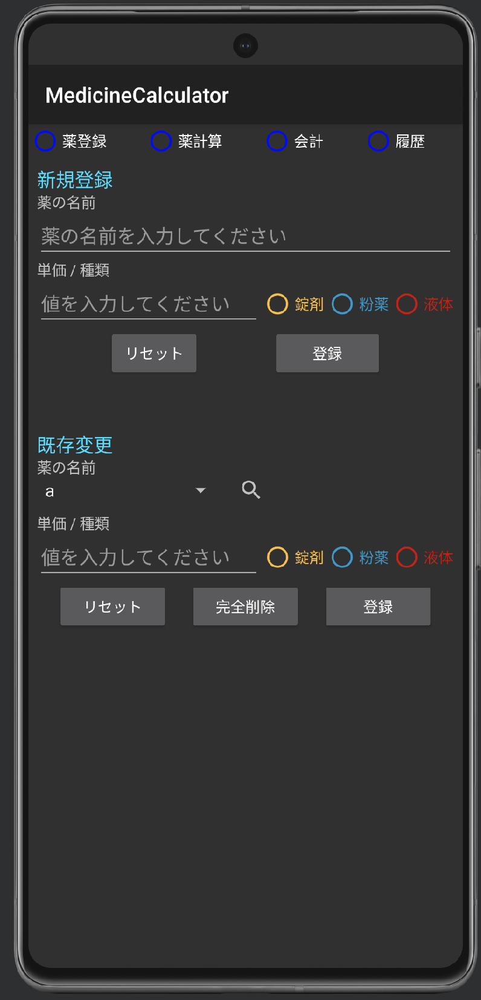

# Medicine Calculator

en / [ja](./README_ja.md)

## Overview

---

This application is a utility for easily calculating the cost of prescription medications for veterinary clinics. By inputting the type of medication, dosage frequency, and duration, you can calculate the total cost and unit price of the prescribed medication.

## Features

---

- Input the medication type, dosage frequency, and duration to calculate the total cost and unit price.
- Use custom buttons to quickly select common dosages (1/8T, 1/4T, 1/2T, 1T, 2T, 3T).
- Option to select dosage frequency per prescription (SID, BID, TID, QID, every 3 days).
- Display calculation results in a user-friendly format and view the total cost.

## Usage

---

1. Launch the app.
2. Click the "Medication List" button to select the type of medication.
3. From the "Dosage Frequency" buttons, select the frequency of dosage.
4. Input the prescribed duration in the "Days" box.
5. Click the "Calculate" button to view the calculation results.
6. Note down the total cost and unit price as needed.

## Demo

---

  
  

## System Requirements

---

- Android 8.1 and above

## License

---

This application is open-source and available under the MIT License. For details, see the `LICENSE` file.