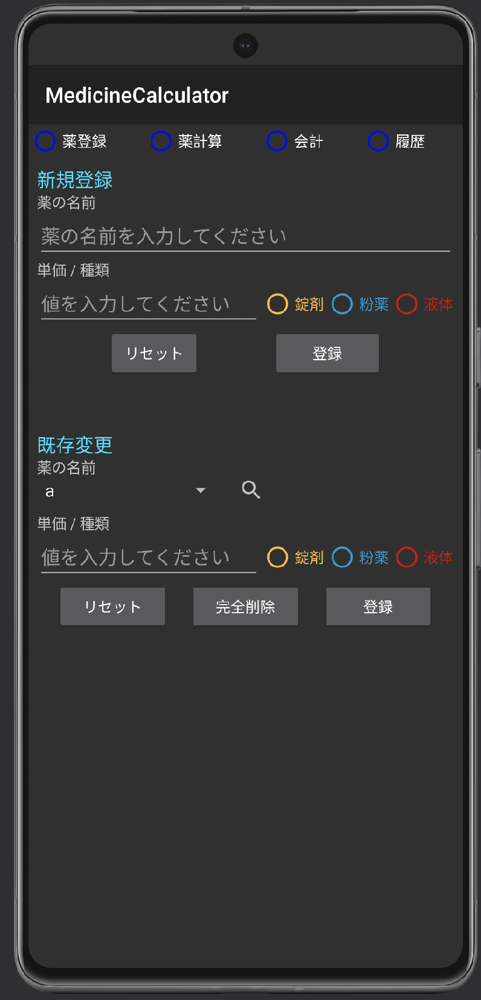

# Medicine Calculator

[en](./README.md) / ja

## 概要

---

このアプリケーションは、動物病院向けの処方薬の値段を簡単に計算するためのユーティリティです。処方された薬の種類や投与回数、日数を入力することで、合計金額や単価を計算できます。

## 特徴

---

- 薬の種類と投与回数、日数を入力して、合計金額と単価を計算します。
- カスタムボタンを使用して、一般的な投与量（1/8T、1/4T、1/2T、1T、2T、3T）を簡単に選択できます。
- 処方薬ごとに投与回数を選択するオプションがあります（SID、BID、TID、QID、3日に1回）。
- 計算結果を見やすい形式で表示し、合計金額を確認できます。

## 使い方

---

1. アプリを起動します。
2. "薬登録" ボタンをクリックして、薬の種類を選択します。
3. "投与回数" ボタンから、投与回数を選択します。
4. "日数" ボックスに、処方された日数を入力します。
5. "決定" ボタンをクリックして計算結果を表示します。
6. 合計金額と単価が表示されるので、必要に応じて記録してください。

## 実行結果

---

  
  

## 動作環境

---

- Android 8.1以降

## ライセンス

---

このアプリケーションはオープンソースで提供されており、MITライセンスの下で使用できます。詳細は `LICENSE` ファイルをご覧ください。